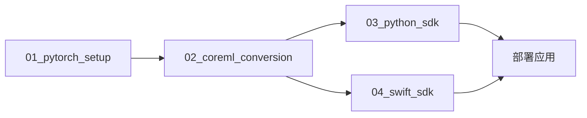

# YOLOv11 CoreML 项目完整指南

这是一个完整的分步指南，帮助你理解整个项目的架构和使用方法。

## 🗺️ 项目概览

这个项目实现了一个完整的 YOLOv11 目标检测解决方案，从预训练 PyTorch 模型到跨平台部署。整个流程分为四个主要步骤：



## 🎯 设计理念

### 模块化设计
每个步骤都是独立的模块，可以单独运行和测试，同时通过共享资源保持连接。

### 跨平台支持
- **Python**: 服务器端、数据处理、API 服务
- **Swift**: iOS/macOS 原生应用、移动端部署

### 生产就绪
包含完整的测试、验证、性能基准和错误处理机制。

## 📋 详细流程

### 第一步：PyTorch 环境搭建 (`01_pytorch_setup/`)

**目标**: 建立基础环境并验证预训练模型功能

**关键文件**:
- `setup_environment.sh` - 自动化环境搭建
- `test_pytorch_model.py` - 完整的模型测试套件
- `requirements.txt` - Python 依赖

**输出**:
- 工作的 Python 虚拟环境
- 下载并验证的 YOLOv11 预训练模型文件
- 基准性能数据

**运行**:
```bash
cd 01_pytorch_setup
./setup_environment.sh
source venv/bin/activate
python test_pytorch_model.py
```

### 第二步：CoreML 转换 (`02_coreml_conversion/`)

**目标**: 将 PyTorch 模型转换为 Apple CoreML 格式并验证

**关键文件**:
- `convert_and_validate.py` - 完整转换和验证流程
- `scripts/` - 各种转换工具
- `coreml_models/` - 转换后的模型输出

**输出**:
- 转换的 CoreML 模型 (.mlpackage)
- 优化后的模型版本
- 验证报告和性能对比

**运行**:
```bash
cd 02_coreml_conversion
pip install -r requirements.txt
python convert_and_validate.py
```

### 第三步：Python SDK (`03_python_sdk/`)

**目标**: 创建易用的 Python SDK，封装 CoreML 模型

**关键文件**:
- `src/yolo_sdk/__init__.py` - 主要 SDK 代码
- `test_sdk.py` - SDK 功能测试
- `pyproject.toml` - 包配置

**特性**:
- 自动模型路径解析
- 丰富的 API 接口
- 性能基准测试
- 完整的错误处理

**使用示例**:
```python
from yolo_sdk import YOLOv11CoreML

model = YOLOv11CoreML()
results = model.predict('image.jpg')
detections = model.predict_and_parse('image.jpg')
```

### 第四步：Swift SDK (`04_swift_sdk/`)

**目标**: 创建 iOS/macOS 原生 SDK

**关键文件**:
- `Sources/YOLOv11CoreMLSDK/YOLOv11CoreMLSDK.swift` - 主要 SDK 接口
- `Sources/YOLOv11CoreMLSDK/YOLOv11Predictor.swift` - 核心预测器
- `Tests/` - 单元测试
- `Package.swift` - Swift Package 配置

**特性**:
- Vision 框架集成
- 异步/并发支持
- 性能基准测试
- 完整的错误处理

**使用示例**:
```swift
let sdk = try YOLOv11CoreMLSDK()
let detections = await sdk.detect(uiImage: image)
```

## 🔧 核心技术栈

### Python 技术栈
- **PyTorch** - 深度学习框架
- **Ultralytics** - YOLO 实现
- **CoreMLTools** - 模型转换
- **NumPy/PIL** - 数据处理

### Swift 技术栈
- **CoreML** - 机器学习推理
- **Vision** - 计算机视觉
- **SwiftUI** - 现代 UI 框架
- **XCTest** - 单元测试

## 📊 共享资源 (`shared_resources/`)

### 目录结构
```
shared_resources/
├── models/           # 模型文件存储
│   ├── yolo11n.pt   # PyTorch 原始模型
│   └── *.mlpackage  # CoreML 转换模型
├── test_images/      # 测试图片
│   └── bus.jpg      # 标准测试图片
└── docs/            # 文档资源
    ├── performance_guide.md
    └── troubleshooting.md
```

### 设计优势
- **集中管理**: 所有模型和资源统一存储
- **版本控制**: 便于跟踪模型版本变化
- **共享访问**: 各个模块都可以访问相同资源

## 🚀 快速使用场景

### 场景 1: 服务器端 API

```python
from yolo_sdk import YOLOv11CoreML
from flask import Flask, request, jsonify

app = Flask(__name__)
model = YOLOv11CoreML()

@app.route('/detect', methods=['POST'])
def detect():
    image_path = request.json['image_path']
    detections = model.predict_and_parse(image_path)
    return jsonify(detections)
```

### 场景 2: iOS 相机应用

```swift
import YOLOv11CoreMLSDK
import AVFoundation

class CameraViewController: UIViewController {
    let sdk = try! YOLOv11CoreMLSDK()
    
    func processFrame(_ image: UIImage) async {
        let detections = await sdk.detect(uiImage: image)
        await updateUI(with: detections)
    }
}
```

### 场景 3: 批量图像处理

```python
import os
from yolo_sdk import YOLOv11CoreML

model = YOLOv11CoreML()
image_dir = "path/to/images"

for filename in os.listdir(image_dir):
    if filename.endswith(('.jpg', '.png')):
        image_path = os.path.join(image_dir, filename)
        detections = model.predict_and_parse(image_path)
        print(f"{filename}: {len(detections)} objects detected")
```

## 📈 性能优化指南

### Python 性能优化

1. **使用 GPU 加速**
```python
# 确保 PyTorch 使用 GPU
import torch
assert torch.cuda.is_available()
```

2. **批量处理**
```python
# 批量处理多张图片
results = model.predict(['img1.jpg', 'img2.jpg', 'img3.jpg'])
```

### Swift 性能优化

1. **使用神经引擎**
```swift
// CoreML 会自动使用神经引擎（如果可用）
let config = MLModelConfiguration()
config.computeUnits = .all  // 使用所有可用的计算单元
```

2. **异步处理**
```swift
// 使用 async/await 避免阻塞 UI
Task {
    let detections = await sdk.detect(uiImage: image)
    await MainActor.run {
        updateUI(with: detections)
    }
}
```

## 🐛 故障排除

### 常见问题

1. **模型文件找不到**
   - 检查文件路径
   - 确认模型转换步骤完成
   - 验证文件权限

2. **依赖版本冲突**
   - 使用虚拟环境隔离依赖
   - 按照 requirements.txt 安装精确版本
   - 升级过时的包

3. **性能问题**
   - 检查硬件加速是否启用
   - 调整推理参数（置信度阈值等）
   - 考虑模型量化

### 调试技巧

1. **启用详细日志**
```python
import logging
logging.basicConfig(level=logging.DEBUG)
```

2. **性能分析**
```python
benchmark_results = model.benchmark('test_image.jpg', num_runs=100)
print(benchmark_results)
```

3. **内存监控**
```python
import psutil
import os

process = psutil.Process(os.getpid())
memory_usage = process.memory_info().rss / 1024 / 1024  # MB
print(f"Memory usage: {memory_usage:.1f} MB")
```

## 🔮 扩展和定制

### 添加新模型

1. **准备模型文件**
```bash
# 将新的 PyTorch 模型放入 shared_resources/models/
cp your_model.pt shared_resources/models/
```

2. **转换为 CoreML**
```bash
cd 02_coreml_conversion
python convert_and_validate.py --model your_model.pt
```

3. **更新 SDK**
```python
# Python SDK
model = YOLOv11CoreML(model_path='path/to/your_model.mlpackage')
```

### 自定义预处理

```python
class CustomYOLOv11CoreML(YOLOv11CoreML):
    def preprocess(self, image):
        # 自定义预处理逻辑
        processed_image = your_preprocessing(image)
        return processed_image
    
    def predict(self, source, **kwargs):
        processed_source = self.preprocess(source)
        return super().predict(processed_source, **kwargs)
```

## 📚 学习资源

### 推荐阅读
- [Apple CoreML 文档](https://developer.apple.com/documentation/coreml)
- [Ultralytics YOLOv11 指南](https://docs.ultralytics.com/)
- [PyTorch 移动端部署指南](https://pytorch.org/mobile/home/)

### 相关项目
- [YOLOv5 CoreML](https://github.com/ultralytics/yolov5)
- [CoreML Examples](https://github.com/apple/coreml-examples)
- [Swift for TensorFlow](https://github.com/tensorflow/swift)

## 🤝 贡献指南

### 开发环境
1. Fork 项目
2. 创建功能分支
3. 提交更改
4. 创建 Pull Request

### 代码规范
- Python: PEP 8
- Swift: Swift API Design Guidelines
- 提交信息: Conventional Commits

---

这个项目为 YOLOv11 的跨平台部署提供了完整的解决方案。无论你是要构建服务器端 API、移动应用，还是进行学术研究，这个项目都能为你提供坚实的基础。